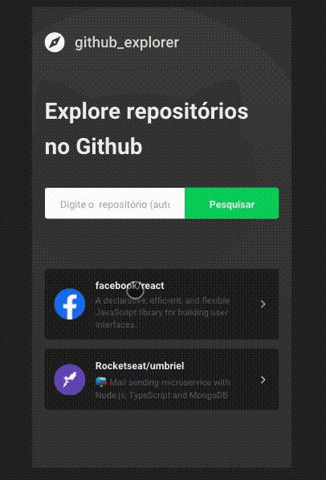

<h1 align="center" background="#2193f6">
    
</h1>

<h3 align="center">
    Explore for repositories in github.
</h3>

<p align="center">
    Search for repositories and browse among their details
</p>

# ❗️ Requisites

- [Node](https://nodejs.org/en/)
- [Yarn](https://yarnpkg.com/lang/en/)

# Cloning this project

```
$ git clone https://github.com/RennanD/github-explorer.git
```

# 💻 Web Application

<h1 align="center">
    
</h1>

## ⚡️ Start

To start application, navigate to github-explorer and run:

```bash
$ yarn
$ yarn start
```

<h1 >



</h1>
